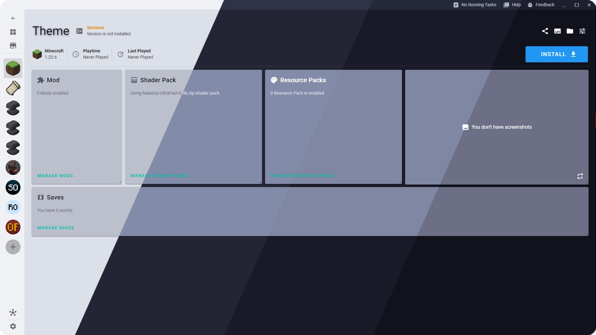
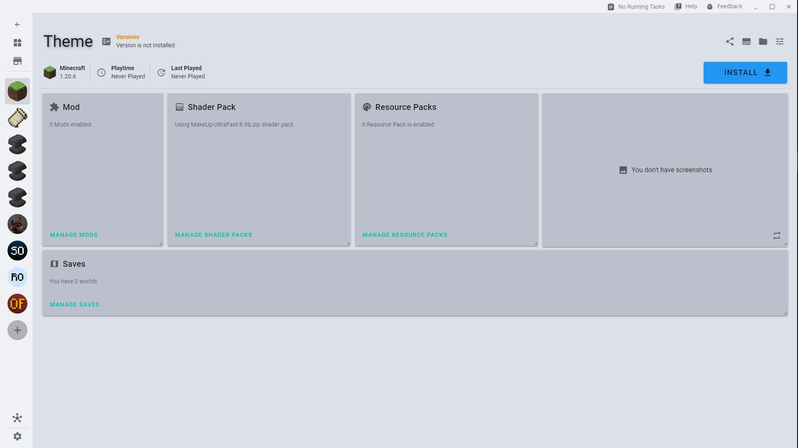
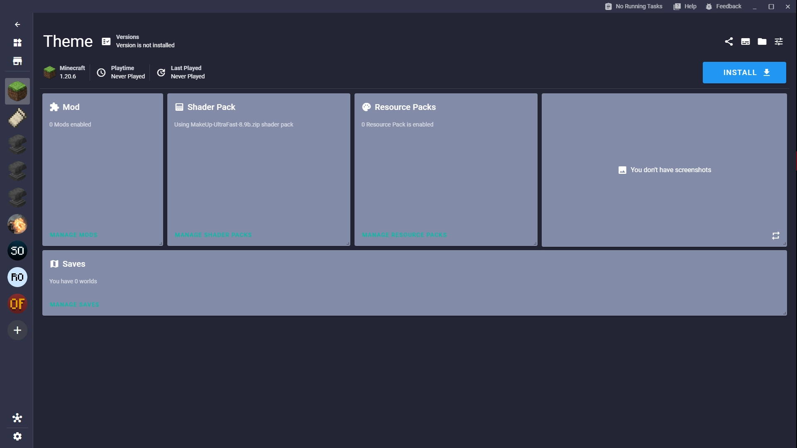
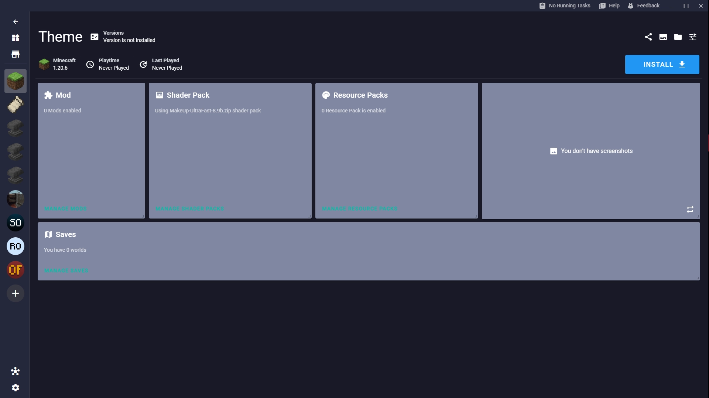
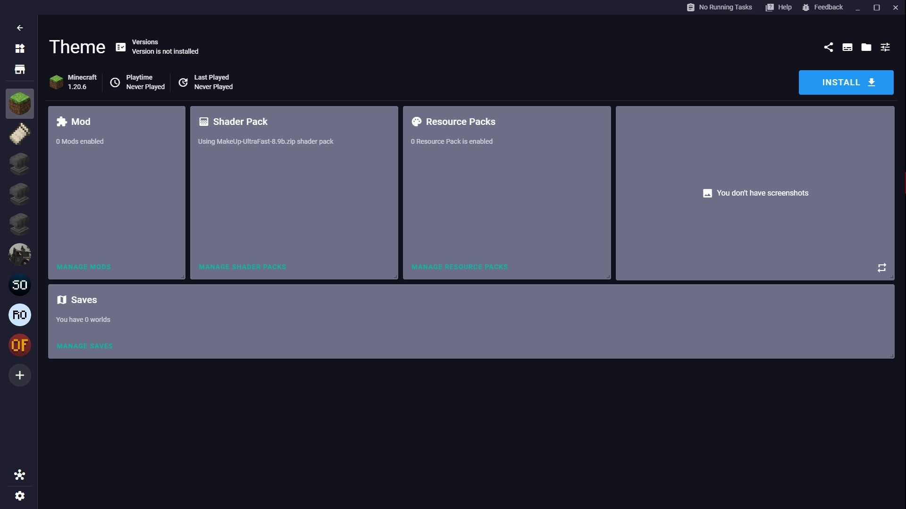

<h3 align="center">
	 
	
	Catppuccin for <a href="https://xmcl.app">XMCL</a>
	
</h3>

	
	
	

	

## Previews

🌻 Latte

🪴 Frappé

🌺 Macchiato

🌿 Mocha

## Usage

1. Download your theme flavor of choice from the [./themes](./themes/) folder. Latte is included as the light mode variant of all themes.
2. Open the XMCL launcher.
3. Go to settings and click **Share Theme** > **Import Theme** and select the downloaded theme.

## 💝 Thanks to

- [v1mkss](https://github.com/v1mkss)
- [BANER](https://github.com/BANSAFAn)

&nbsp;

	

	Copyright &copy; 2021-present <a href="https://github.com/catppuccin" target="_blank">Catppuccin Org</a>

	

